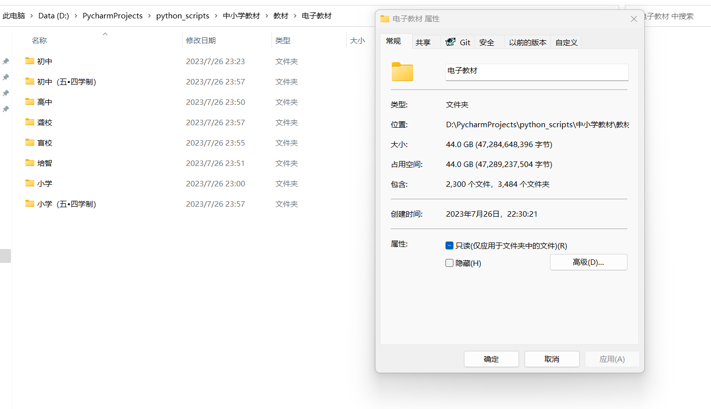

<div align=center></div>
<div align=center></div>
<div align="center">


<strong>一个现代、实用的国家中小学电子教材下载客户端，使用 Python + flet 构建，支持Windows和macOS平台。</strong>
</div>

# 需求背景

之前我在[吾爱破解](https://www.52pojie.cn)论坛上发表过一篇[国家中小学智慧教育平台电子教材全套下载](https://www.52pojie.cn/thread-1822239-1-1.html)的帖子，当时分享了使用Python打包下载所有电子教材的方法。评论区收到很多反馈想按需下载，最近利用业余时间使用 Python + flet 开发了这款应用程序，满足大家的需求，同时支持Windows和macOS平台用户。



# 免责声明

* 本软件开源免费，严禁盗卖！任何个人或组织不得将本软件用于商业用途。
* 本软件中所涉及的技术仅供学习交流，任何个人或组织不得对国家中小学智慧教育平台进行大规模数据爬取。
* 对于违反相关法律，造成危害的滥用行为，本人不承担任何法律责任。
* 使用本软件即表示您同意本免责声明中的所有条款。

# 功能清单

- [x] 左侧导航栏展示学段信息，支持点击切换右侧内容区域（完成）
- [x] 右侧内容区域按学科、版本、年级筛选电子教材（完成）
- [x] 右侧内容区域支持电子教材下载及展示下载进度（完成）
- [x] 主题切换（完成）
- [ ] 任务栏通知（开发中）
- [ ] 教材预览（评估中）
- [ ] 个性化设置（评估中）
- [ ] 功能优化

# 快速体验

点击 https://github.com/v5tech/ebook-downloader/releases 选择适合自己的版本下载即可。

# 功能截图

* 软件首页

* 下载书籍

* 下载完成

* 深色主题

* 浅色主题

* 免责声明


# 源码构建

* macOS执行以下命令

```bash
python3 -m venv venv
source venv/bin/activate
pip install -r requirements.txt
flet pack main.py --icon assets/icon.icns --name ebook-downloader --distpath dist --add-data=assets/*:assets
```

* Windows执行以下命令

```bash
python3 -m venv venv
venv\Scripts\activate
pip install -r requirements.txt
flet pack main.py --icon assets/icon.ico --name ebook-downloader --distpath dist --add-data=assets/*:assets
```

# 星星之路

[](https://starchart.cc/v5tech/ebook-downloader)

# 开源协议

Apache-2.0 license

# 感谢

- [国家中小学智慧教育平台](https://basic.smartedu.cn)
- [flet-dev](https://github.com/flet-dev/flet)